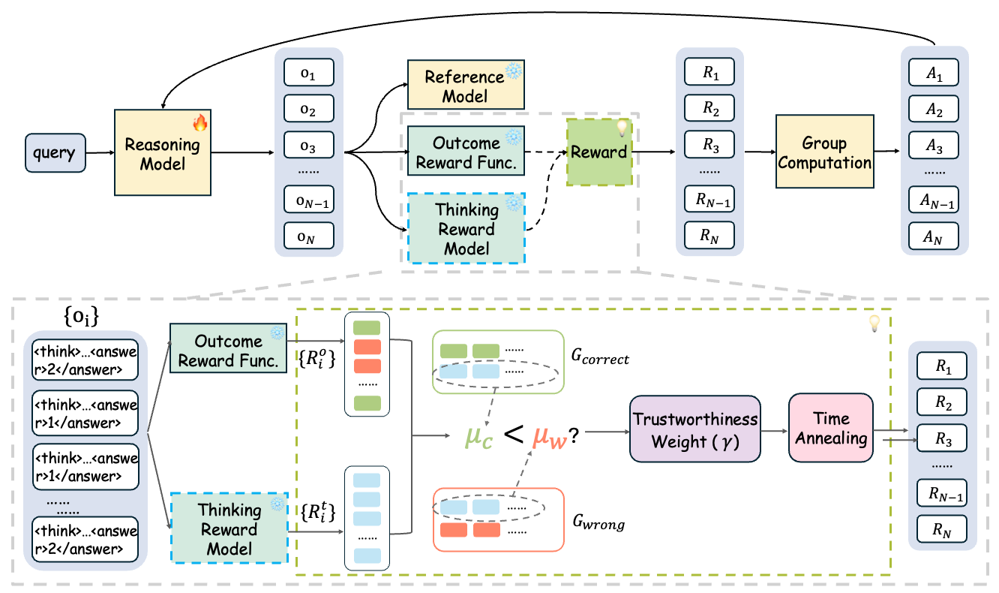

# SophiaVL-R1

[[paper]]() [[SophiaVL-R1-7B model]](https://huggingface.co/bunny127/SophiaVL-R1-7B) [[SophiaVL-R1-130k]](https://huggingface.co/datasets/bunny127/SophiaVL-R1-130k) [[SophiaVL-R1-Thinking-156k Dataset]](https://huggingface.co/datasets/bunny127/SophiaVL-R1-Thinking-156k)

## About SophiaVL-R1

We introduce SophiaVL-R1 to explore the R1 paradigm for enhancing thinking-level supervision in vision-language reasoning.
We introduce Trust-GRPO, a trust-aware extension of GRPO that assigns dynamic trust weights to thinking-level rewards based on reward comparisons between correct and incorrect responses. Additionally, we design an annealing strategy that gradually shifts the learning signal from process rewards to rule-based outcome rewards during training.
Our SophiaVL-R1-7B model achieves strong performance on multiple multimodal reasoning benchmarks. SophiaVL-R1-7B outperforms LLaVA-OneVision-72B on MathVista and MMMU, despite having 10× fewer parameters.




## Reqirements
### Software Requirements
- Python 3.9+
- transformers>=4.51.0
- flash-attn>=2.4.3
- vllm>=0.8.3


## Quick Start

### Download the model
We recommend using huggingface-cli to download the model. You can use the following command to download the model:
```bash
# download huggingface-cli
pip install -U huggingface_hub
huggingface-cli login

huggingface-cli download SophiaVL-R1 --local-dir <local_dir>
```

### Training
#### Enviroment Variables

- `OPENAI_API_KEY`: Key for Reward Model API
- `OPENAI_API_URL`: URL for Reward Model API
- `REWARD_MODEL`: Model name of Reward Model


#### Training Scripts

Start training:
```
bash scripts/train_scripts/run_train.sh
```

Modify your training parameters in `scripts/train_scripts/fullsets.yaml`. `train_files` should be seperated with comma.

#### Merge Checkpoint in HuggingFace Format
The checkpoints saved during training need to be merged before using.
```bash
python3 scripts/model_merger.py --local_dir checkpoints/easy_r1/exp_name/global_step_1/actor
```

### Inference
We provide a simple inference script for you to test the model. The full script is [here](./scripts/inference_single.py). Have a try with your data!
```bash
# example
MODEL_PATH = "bunny127/SophiaVL-R1-7B" # or your local path
image_path = "/path/to/dataset/Math/CLEVR-Math/images/CLEVR_train_036427.png" # your local image path
prompt = "Subtract 0 cyan cubes. How many objects are left?"
question_type = "numerical" # numerical, multiple_choice, free-form, OCR
```
### Evaluation

We use [VLMEvalKit](https://github.com/open-compass/VLMEvalKit) for evaluation. To register our model, add model description in `vlmeval/config.py`:

```python
"trained_model": partial(
        Qwen2VLChat,
        model_path="/path/to/model",
        min_pixels=1280 * 28 * 28,
        max_pixels=16384 * 28 * 28,
        use_custom_prompt=False,
    ),
```
## Dataset
We provide the [SophiaVL-R1-130k Dataset](https://huggingface.co/datasets/bunny127/SophiaVL-R1-130k) and the [SophiaVL-R1-Thinking-156k Dataset](https://huggingface.co/datasets/bunny127/SophiaVL-R1-Thinking-156k).

Download dataset:
```bash
# download huggingface-cli
pip install -U huggingface_hub
huggingface-cli login

huggingface-cli download bunny127/SophiaVL-R1-130k --repo-type dataset --local-dir <local_dir>
```

Our SophiaVL-R1-130k dataset is collected from publicly available datasets.


### Custom Dataset for Training
We support text-dataset and image-text dataset both in parquet and json file format. To train on your own datasets, please register your dataset in `verl/data/dataset_info.json` in the following format：
```python
"myDataset":{
        "file_path":"/path/to/your/dataset",
        "image_base_path":"/your/image/base/path",
        "columns":{
            "column_reponses_to_prompt":"prompt",
            "column_reponses_to_answer":"answer",
            "column_reponses_to_images":"images"
        }
    },
```
## Performance


### Training Curves


## More Reasoning Examples


## Acknowledgements

We sincerely appreciate the contributions of the open-source community. This work is built upon [EasyR1](https://github.com/hiyouga/EasyR1).