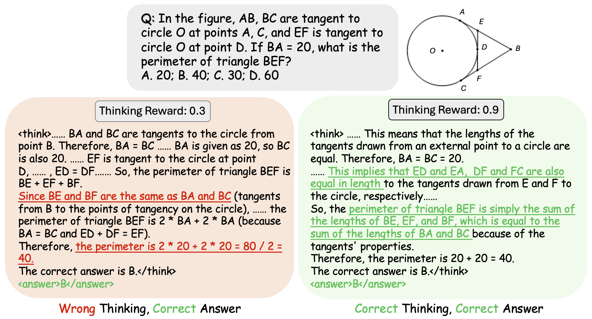

# SophiaVL-R1: Reinforcing MLLMs Reasoning with Thinking Reward

<p align="center">
  <a href="https://arxiv.org/pdf/2505.17018">[📖paper]</a> &nbsp;&nbsp;
  <a href="https://huggingface.co/bunny127/SophiaVL-R1-7B">[🤗SophiaVL-R1-7B model]</a> &nbsp;&nbsp;
  <a href="https://huggingface.co/bunny127/SophiaVL-R1-Thinking-Reward-Model-3B">[🤗Thinking Reward Model]</a>
</p>

<p align="center">
<a href="https://huggingface.co/datasets/bunny127/SophiaVL-R1-130k">[🤗SophiaVL-R1-130k Dataset]</a> &nbsp;&nbsp;
<a href="https://huggingface.co/datasets/bunny127/SophiaVL-R1-Thinking-156k">[🤗SophiaVL-R1-Thinking-156k Dataset]</a>
</p>

## Intro

We introduce **SophiaVL-R1** to explore the R1 paradigm using **thinking-level rewards** in vision-language reasoning, motivated by the phenomenon of "**wrong thinking, correct answer**"

To achieve this, we train a **Thinking Reward Model** to yield a reward that measures the thinking process from various dimensions, using our curated **SophiaVL-R1-Thinking-156k** dataset.

Besides, We introduce the **Trust-GRPO** algorithm, which assigns a trustworthiness weight to thinking rewards based on their reliability. This method guides the model to explore favorable reasoning policies in a trustworthy manner **without extra computational overhead** for uncertainty estimation.

Our SophiaVL-R1-7B model achieves **strong performance** across multiple benchmarks (e.g., 61.3% on MMMU) and can be efficiently trained on 8 A100 GPUs in just 1,500 steps using our **SophiaVL-R1-Thinking-130k** dataset.


<div align="center">
  
</div>

 

## Reqirements

### Software Requirements

- Python 3.9+
- transformers>=4.51.0
- flash-attn>=2.4.3
- vllm>=0.8.3

Start with the following commands:

```bash
git clone https://github.com/kxfan2002/SophiaVL-R1.git
cd SophiaVL-R1  
conda create -n sophiavl python=3.10
conda activate sophiavl
pip install -r requirements.txt
```

## Quick Start

### Download the model

We recommend using huggingface-cli to download the model. You can use the following command to download the model:

```bash
# download huggingface-cli
pip install -U huggingface_hub
huggingface-cli login

# download the trained thinking reward model
huggingface-cli download bunny127/SophiaVL-R1-Thinking-Reward-Model-3B --local-dir <local_dir>
```

### Dataset

We provide the [SophiaVL-R1-130k Dataset](https://huggingface.co/datasets/bunny127/SophiaVL-R1-130k) for RL training and the [SophiaVL-R1-Thinking-156k Dataset](https://huggingface.co/datasets/bunny127/SophiaVL-R1-Thinking-156k) for the training of thinking reward model.

Download dataset:

```bash
# download huggingface-cli
pip install -U huggingface_hub
huggingface-cli login

huggingface-cli download bunny127/SophiaVL-R1-130k --repo-type dataset --local-dir <local_dir>
```

Our SophiaVL-R1-130k dataset encompasses a wide range of reasoning data.

<div align="center">
  
</div>

#### Custom Dataset for Training

We support text-dataset and image-text dataset both in parquet and json file format. To train on your own datasets, please register your dataset in `verl/data/dataset_info.json` in the following format：

```python
"myDataset":{
        "file_path":"/path/to/your/dataset",
        "image_base_path":"/your/image/base/path",
        "columns":{
            "column_reponses_to_prompt":"prompt",
            "column_reponses_to_answer":"answer",
            "column_reponses_to_images":"images"
        }
    },
```

### Training

#### Training Scripts

To begin training, you first need to launch the Thinking Reward Model server using `vllm`:

```bash
bash scripts/train_scripts/thinking_reward_model.sh
```

This script starts the Thinking Reward Model and exposes it in the OpenAI API format.

Next, set the following environment variables in `scripts/train_scripts/run_train.sh` so that the training script can access the reward model:

- `OPENAI_API_KEY`: Key for Reward Model API
- `OPENAI_API_URL`: URL for Reward Model API
- `REWARD_MODEL`: Model name of Reward Model

Modify your training parameters in `scripts/train_scripts/fullsets.yaml`. 

Finally, start the training process with:

```
bash scripts/train_scripts/run_train.sh
```

#### Merge Checkpoint in HuggingFace Format

After training, the saved checkpoints need to be merged before inference in [EasyR1](https://github.com/hiyouga/EasyR1). This script will transfer the saved checkpoints to HuggingFace format. 

```bash
python3 scripts/model_merger.py --local_dir checkpoints/easy_r1/exp_name/global_step_1/actor
```

### Inference

We provide a simple inference script for you to test the model. The full script is [here](./scripts/inference_single.py). Have a try with your data!

```bash
# download the trained reasoning model for direct inference
huggingface-cli download bunny127/SophiaVL-R1-7B --local-dir <local_dir>

# Modify the below fields to your test data
MODEL_PATH = "bunny127/SophiaVL-R1-7B" # or your local path
image_path = "/path/to/dataset/Math/CLEVR-Math/images/CLEVR_train_036427.png" # your local image path
prompt = "Subtract 0 cyan cubes. How many objects are left?"
question_type = "numerical" # numerical, multiple_choice, free-form, OCR
```

### Evaluation

We use [VLMEvalKit](https://github.com/open-compass/VLMEvalKit) for evaluation of SophiaVL-R1. To register our model in VLMEvalKit, add model description in `vlmeval/config.py`:

```python
"trained_model": partial(
        Qwen2VLChat,
        model_path="/path/to/model",
        min_pixels=1280 * 28 * 28,
        max_pixels=16384 * 28 * 28,
        use_custom_prompt=False,
    ),
```

We use the following systemt prompt for the evalutation of all models:
```
system_prompt="You FIRST think about the reasoning process as an internal monologue and then provide the final answer. Please think about this question as if you were a human pondering deeply. Engage in an internal dialogue using expressions such as 'let me think', 'wait', 'Hmm', 'oh, I see', 'let's break it down', etc, or other natural language thought expressions. It's encouraged to include self-reflection or verification in the reasoning process.The reasoning process MUST BE enclosed within <think> </think> tagsdd. The final answer MUST BE enclosed within <answer> </answer> tags, for example <think>your_thinking_process</think><answer>your_final_answer</answer>. If you use formula, please use LaTeX format.",
```


## Performance of SophiaVL-R1-7B

SophiaVL-R1-7B demonstrates strong performance across multiple MLLM benchmarks, including both mathematical reasoning and general capability tasks.

<div align="center">
  
</div>

<div align="center">
  
</div>

 

### Training Curves

This figure shows the accuracy reward curves during training. It is evident that SophiaVL-R1, trained with thinking-level rewards and Trust-GRPO, achieves significantly better training performance.

<div align="center">
  
</div>


## More Reasoning Examples of SophiaVL-R1

<div align="center">
  
</div>

<div align="center">
  
</div>

<div align="center">
  
</div>

<div align="center">
  
</div>


## Acknowledgements

We sincerely appreciate the contributions of the open-source community. This work is built upon [EasyR1](https://github.com/hiyouga/EasyR1).

## Citations

If you find our work helpful for your research, please consider citing our work.   

```
@article{fan2025sophiavl,
  title={SophiaVL-R1: Reinforcing MLLMs Reasoning with Thinking Reward},
  author={Fan, Kaixuan and Feng, Kaituo and Lyu, Haoming and Zhou, Dongzhan and Yue, Xiangyu},
  journal={arXiv preprint arXiv:2505.17018},
  year={2025}
}
```
